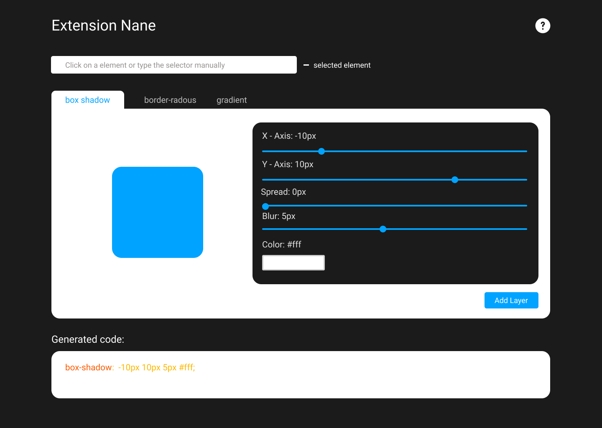

# CSS-Tools Extension
visually create shadows, border radius and transforms while interacting with page elements in real time.

[View Demo](https://github.com/0shuvo0/css-tools-ext/blob/main/demo.mp4)

See [Web Version](https://0shuvo0.github.io/css-tools/)

## Usage
1. Clone this repo
2. Open chreome and go to chrome://extensions/
3. Enable developer mode
4. Click on load unpacked and select the cloned repo